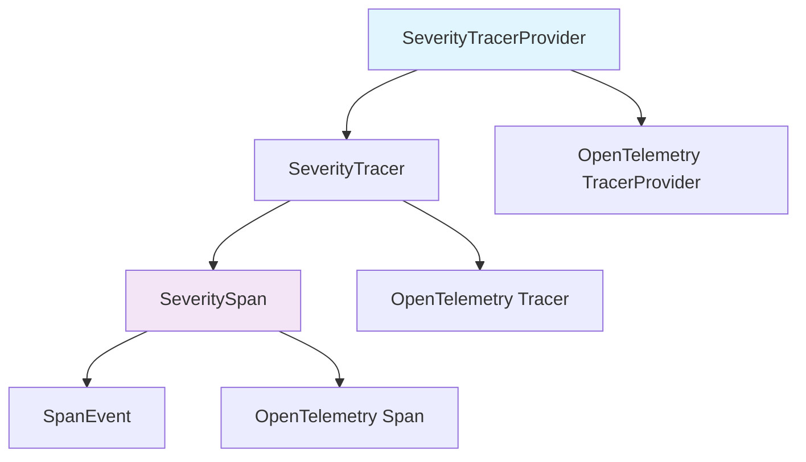
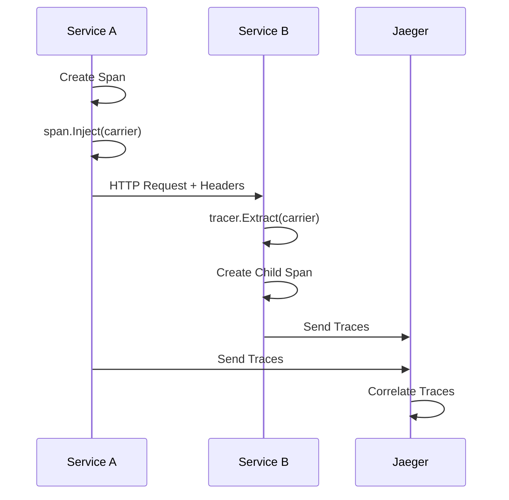

# Trace - Severity-based Distributed Tracing Library

[](https://golang.org/dl/)
[](https://opentelemetry.io/)
[](LICENSE)
[](https://goreportcard.com/report/github.com/Bofry/trace)
[](https://www.jaegertracing.io/)
[](https://opentelemetry.io/docs/reference/specification/protocol/otlp/)

> **[中文版文件 (Chinese Documentation)](./README_ZH.md)**
> **推薦閱讀中文版，包含更詳細的使用說明和最佳實踐範例**

**github.com/Bofry/trace** is a structured, severity-based distributed
tracing library built on OpenTelemetry. It enhances standard OpenTelemetry spans
with severity levels (DEBUG through EMERG) and provides fluent APIs for
structured logging and cross-service trace propagation with Jaeger integration.

## Key Features

- **8-Level Severity System**: Following syslog standard (DEBUG to EMERG)
- **Fluent API**: Intuitive method chaining for span operations
- **Cross-Service Tracing**: Complete distributed tracing context propagation
- **Deferred Event System**: Efficient event batching with flush-on-end
- **No-op Detection**: Automatic performance optimization for disabled tracing

## Installation

```bash
go get github.com/Bofry/trace
```

## Quick Start

```go
package main

import (
    "context"
    "github.com/Bofry/trace"
    "log"
    "time"
)

func main() {
    // Create TracerProvider
    tp, err := trace.JaegerProvider("http://localhost:14268/api/traces",
        trace.ServiceName("my-service"),
        trace.Environment("production"),
        trace.Pid(),
    )
    if err != nil {
        log.Fatal(err)
    }

    // Set as global provider
    trace.SetTracerProvider(tp)

    // Create tracer and span
    tracer := trace.Tracer("main")
    span := tracer.Open(context.Background(), "main-operation")
    defer span.End()

    // Use severity-based logging
    span.Info("Operation started")
    span.Debug("Debug info: %s", "some debug data")

    // Record structured data
    span.Argv(map[string]any{"user_id": 123, "action": "create"})
    span.Reply(trace.PASS, "Operation completed")

    // Graceful shutdown
    defer func(ctx context.Context) {
        ctx, cancel := context.WithTimeout(ctx, time.Second*5)
        defer cancel()
        tp.Shutdown(ctx)
    }(context.Background())
}
```

## Architecture Overview



## Severity Levels

| Level | Value | Name | Usage |
|-------|-------|------|-------|
| DEBUG | 0 | debug | Debug information |
| INFO | 1 | info | General information |
| NOTICE | 2 | notice | Important information |
| WARN | 3 | warn | Warning messages |
| ERR | 4 | err | Error messages |
| CRIT | 5 | crit | Critical errors |
| ALERT | 6 | alert | Immediate attention needed |
| EMERG | 7 | emerg | System unusable |

## Span Management Patterns

### Provider Initialization

```go
// Modern OTLP approach (recommended)
tp, err := trace.OTLPProvider("http://localhost:4318",
    trace.ServiceName("my-service"),
    trace.Environment("production"),
)

// Legacy Jaeger approach (backward compatible)
tp, err := trace.JaegerProvider("http://localhost:14268/api/traces",
    trace.ServiceName("my-service"),
)
```

### Span Creation Methods

```go
// Root span - creates new trace
rootSpan := tracer.Open(ctx, "root-operation")

// Child span - inherits current context
childSpan := tracer.Start(parentSpan.Context(), "child-operation")

// Linked span - related but not parent-child
linkedSpan := tracer.Link(ctx, parentSpan.Link(), "linked-operation")

// Extracted span - from cross-service context
extractedSpan := tracer.Extract(ctx, carrier, "extracted-operation")
```

## Cross-Service Tracing



### Context Propagation Example

```go
// Service A - Inject context
carrier := make(propagation.MapCarrier)
span.Inject(nil, carrier)

// Pass through HTTP headers
for key, value := range carrier {
    req.Header.Set(key, value)
}

// Service B - Extract context
carrier := make(propagation.MapCarrier)
for key, values := range req.Header {
    if len(values) > 0 {
        carrier.Set(key, values[0])
    }
}

extractedSpan := tracer.Extract(ctx, carrier, "downstream-operation")
```

## Testing Setup

### Jaeger with Docker

```bash
docker run -d --name jaeger \
  -p 16686:16686 \
  -p 14268:14268 \
  -p 4317:4317 \
  -p 4318:4318 \
  jaegertracing/all-in-one:latest
```

### Test Configuration

```bash
# Copy test environment file
cp trace_test.env.sample trace_test.env

# Edit with your Jaeger endpoints
# JAEGER_TRACE_URL=http://127.0.0.1:14268/api/traces
# JAEGER_QUERY_URL=http://127.0.0.1:16686/api/traces
```

### Development Workflow

```bash
# Standard development sequence
go mod tidy           # Clean up dependencies
go fmt ./...          # Format all code
go vet ./...          # Static analysis
go test ./...         # Run all tests

# Additional testing
go test -cover ./...  # Coverage analysis
go test -race ./...   # Race condition detection
```

## Performance Considerations

- **No-op Detection**: Automatically optimizes performance when tracing is disabled
- **Event Batching**: Deferred event processing with flush-on-end
- **Atomic Operations**: Thread-safe global state management
- **Lazy Evaluation**: Attributes constructed only when needed

## Test Coverage & Performance Analysis

### Test Statistics

- **Test Coverage**: 90.7% (89/89 tests passing)
- **Total Test Files**: 5 comprehensive test suites
- **Benchmark Tests**: 19 performance benchmarks

### Performance Benchmarks

#### Core Operations (ops/sec)

```textplain
BenchmarkSeveritySpan_Debug         3,250,894    398.8 ns/op    912 B/op    8 allocs/op
BenchmarkSeveritySpan_Info          3,084,661    410.0 ns/op    912 B/op    8 allocs/op
BenchmarkSeveritySpan_Notice        2,995,432    415.3 ns/op    912 B/op    8 allocs/op
BenchmarkSeveritySpan_Warning       3,104,412    406.7 ns/op    912 B/op    8 allocs/op
BenchmarkSeveritySpan_Crit          3,089,513    408.5 ns/op    912 B/op    8 allocs/op
BenchmarkSeveritySpan_Alert         3,101,745    407.2 ns/op    912 B/op    8 allocs/op
BenchmarkSeveritySpan_Emerg         3,100,453    407.3 ns/op    912 B/op    8 allocs/op
```

#### No-op Span Optimization

```textplain
BenchmarkNoopSpan_Debug            36,734,693     28.04 ns/op     0 B/op    0 allocs/op
BenchmarkNoopSpan_Info             43,588,951     27.45 ns/op     0 B/op    0 allocs/op
BenchmarkNoopSpan_Warning          43,745,951     27.41 ns/op     0 B/op    0 allocs/op
BenchmarkNoopSpan_Err              43,705,951     27.43 ns/op     0 B/op    0 allocs/op
```

#### Memory Efficiency

- **Recording Span**: ~400ns per operation, 912 bytes allocated
- **No-op Span**: ~28ns per operation, zero allocations
- **Optimization Ratio**: 14x performance improvement when tracing disabled

## API Reference

### Core Types

- `SeverityTracerProvider`: Enhanced tracer provider
- `SeverityTracer`: Creates severity-enabled spans
- `SeveritySpan`: Span with severity logging methods
- `SpanEvent`: Deferred event system
- `Severity`: 8-level severity enum

### Provider Creation

- `JaegerProvider(url, attrs...)`: Jaeger-compatible provider
- `OTLPProvider(endpoint, attrs...)`: OTLP HTTP provider
- `OTLPGRPCProvider(endpoint, attrs...)`: OTLP gRPC provider

### Span Methods

- **Severity Logging**: `Debug()`, `Info()`, `Notice()`, `Warning()`,
  `Crit()`, `Alert()`, `Emerg()`
- **Data Recording**: `Argv()`, `Reply()`, `Tags()`, `Err()`
- **Context Operations**: `Inject()`, `Link()`, `Context()`

## Contributing

1. Fork the repository
2. Create a feature branch (`git checkout -b feature/amazing-feature`)
3. Commit your changes (`git commit -m 'Add amazing feature'`)
4. Push to the branch (`git push origin feature/amazing-feature`)
5. Open a Pull Request

## License

This project is licensed under the [MIT License](LICENSE).

## Related Projects

- [OpenTelemetry Go](https://github.com/open-telemetry/opentelemetry-go)
- [Jaeger Tracing](https://www.jaegertracing.io/)
- [OTLP Protocol](https://opentelemetry.io/docs/reference/specification/protocol/otlp/)

---

**Note**: This library has completely migrated from the deprecated Jaeger
exporter to modern OTLP protocol while maintaining full backward compatibility.

> **[完整中文文件請參閱 README_ZH.md](./README_ZH.md)**
