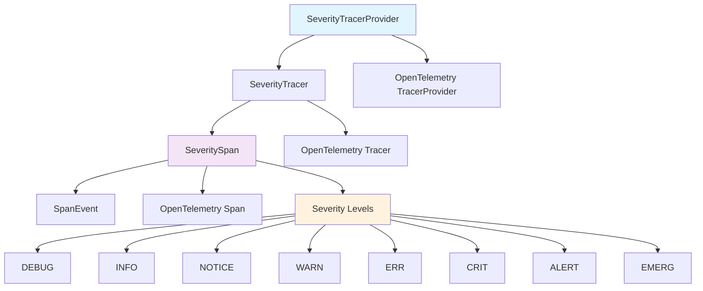
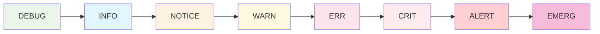
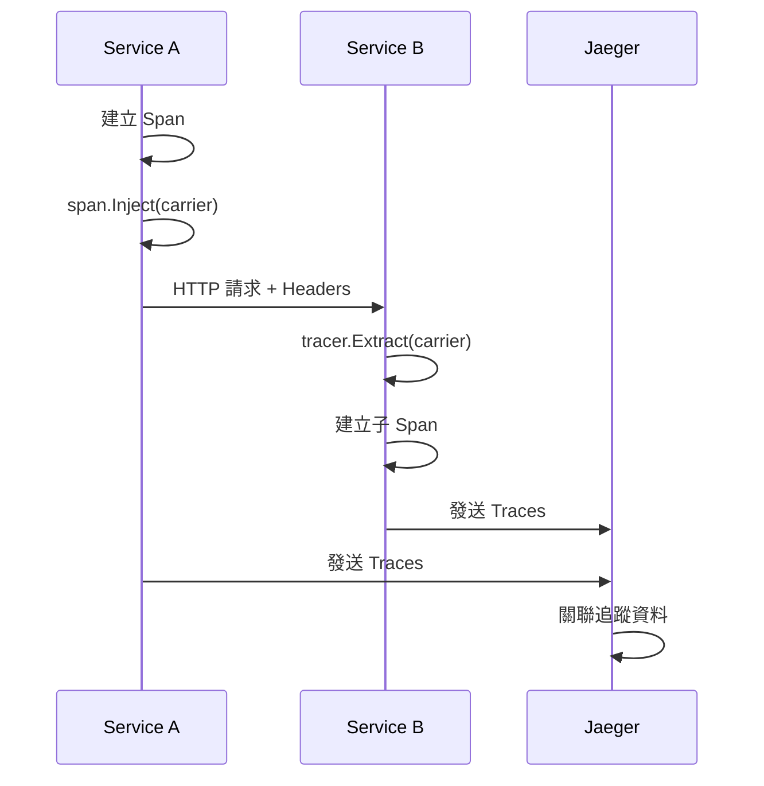

# Trace - 基於嚴重性的分散式追蹤庫

[](https://golang.org/dl/)
[](https://opentelemetry.io/)
[](LICENSE)
[](https://goreportcard.com/report/github.com/Bofry/trace)
[](README_ZH.md)

**github.com/Bofry/trace** 是一個建構於 OpenTelemetry 之上的結構化、基於嚴重性的分散式追蹤庫。它使用嚴重性等級（DEBUG 到 EMERG）增強標準的 OpenTelemetry spans，並提供流暢的 API 用於結構化記錄和跨服務追蹤傳播，與 Jaeger 無縫整合。

## 核心特性

- **嚴重性分級系統**：遵循 syslog 標準的 8 級嚴重性等級
- **流暢 API**：簡潔直觀的鏈式調用方式
- **跨服務追蹤**：支援完整的分散式追蹤上下文傳播
- **事件延遲處理**：高效的事件批次處理機制
- **無操作檢測**：自動偵測並優化無追蹤場景的效能開銷

## 安裝

```bash
go get github.com/Bofry/trace
```

## 快速開始

### 基本使用

```go
package main

import (
    "context"
    "github.com/Bofry/trace"
    "log"
    "time"
)

func main() {
    // 1. 建立 TracerProvider
    tp, err := trace.JaegerProvider("http://localhost:14268/api/traces",
        trace.ServiceName("my-service"),
        trace.Environment("production"),
        trace.Pid(),
    )
    if err != nil {
        log.Fatal(err)
    }

    // 2. 設定為全域 Provider
    trace.SetTracerProvider(tp)

    // 3. 建立 Tracer
    tracer := trace.Tracer("main")

    ctx := context.Background()

    // 4. 建立根 Span
    span := tracer.Open(ctx, "main-operation")
    defer span.End()

    // 5. 使用嚴重性記錄
    span.Info("操作開始")
    span.Debug("除錯資訊：%s", "some debug info")

    // 6. 記錄輸入參數
    span.Argv(map[string]any{
        "user_id": 123,
        "action":  "create",
    })

    // 7. 記錄回應
    span.Reply(trace.PASS, "操作完成")

    // 8. 優雅關閉
    defer func(ctx context.Context) {
        ctx, cancel := context.WithTimeout(ctx, time.Second*5)
        defer cancel()
        tp.Shutdown(ctx)
    }(ctx)
}
```

## 架構概覽



## 嚴重性等級系統

| 等級 | 數值 | 名稱 | 用途 |
|------|------|------|------|
| DEBUG | 0 | debug | 除錯資訊 |
| INFO | 1 | info | 一般資訊 |
| NOTICE | 2 | notice | 重要資訊 |
| WARN | 3 | warn | 警告訊息 |
| ERR | 4 | err | 錯誤訊息 |
| CRIT | 5 | crit | 嚴重錯誤 |
| ALERT | 6 | alert | 需要立即處理 |
| EMERG | 7 | emerg | 系統無法使用 |



## Span 管理模式

### 1. Open - 根 Span

```go
// 建立新的根 span，不繼承上下文
span := tracer.Open(ctx, "root-operation")
defer span.End()
```

### 2. Start - 子 Span

```go
// 建立子 span，繼承當前上下文
childSpan := tracer.Start(span.Context(), "child-operation")
defer childSpan.End()
```

### 3. Link - 連結 Span

```go
// 建立連結的 span，用於關聯但不是父子關係的操作
link := parentSpan.Link()
linkedSpan := tracer.Link(ctx, link, "linked-operation")
defer linkedSpan.End()
```

### 4. Extract - 跨服務 Span

```go
// 從傳播載體中提取上下文
extractedSpan := tracer.Extract(ctx, carrier, "extracted-operation")
defer extractedSpan.End()
```

## 跨服務追蹤流程



## 最佳實踐

### Provider 初始化

```go
// 推薦：使用 OTLP Provider（現代方式）
tp, err := trace.OTLPProvider("http://localhost:4318",
    trace.ServiceName("my-service"),
    trace.Environment("production"),
    trace.Version("v1.0.0"),
)

// 或使用 Jaeger Provider（向下相容）
tp, err := trace.JaegerProvider("http://localhost:14268/api/traces",
    trace.ServiceName("my-service"),
    trace.Environment("production"),
)
```

### 錯誤處理模式

```go
func businessLogic(ctx context.Context) error {
    span := tracer.Start(ctx, "business-logic")
    defer span.End()

    span.Argv(inputData) // 記錄輸入

    result, err := doWork()
    if err != nil {
        span.Err(err) // 記錄錯誤
        return err
    }

    span.Reply(trace.PASS, result) // 記錄成功結果
    return nil
}
```

### 結構化記錄

```go
span.Debug("處理請求").Tags(
    trace.Key("user_id").String("12345"),
    trace.Key("action").String("create"),
    trace.Key("duration_ms").Int64(duration.Milliseconds()),
)

// 自動展開物件
span.Argv(struct {
    UserID   string `json:"user_id"`
    Action   string `json:"action"`
    Metadata map[string]any `json:"metadata"`
}{
    UserID: "12345",
    Action: "create",
    Metadata: map[string]any{"source": "web"},
})
```

### 上下文傳播

```go
// 服務 A - 注入上下文
carrier := make(propagation.MapCarrier)
span.Inject(nil, carrier) // 使用預設傳播器

// 通過 HTTP Headers 傳遞
for key, value := range carrier {
    req.Header.Set(key, value)
}

// 服務 B - 提取上下文
carrier := make(propagation.MapCarrier)
for key, values := range req.Header {
    if len(values) > 0 {
        carrier.Set(key, values[0])
    }
}

extractedSpan := tracer.Extract(ctx, carrier, "downstream-operation")
```

## 配置選項

### Provider 選項

```go
// 完整配置範例
tp, err := trace.JaegerProvider("http://localhost:14268/api/traces",
    // 服務識別
    trace.ServiceName("my-service"),
    trace.Environment("production"),
    trace.Version("v1.2.3"),

    // 系統資訊
    trace.OS(),           // 自動偵測作業系統
    trace.Pid(),          // 程序 ID

    // 自定義標籤
    trace.Key("region").String("asia-pacific"),
    trace.Facility("api-gateway"),
    trace.Signature("sha256:abc123"),
)
```

### 全域設定

```go
// 設定全域 TracerProvider
trace.SetTracerProvider(tp)

// 設定傳播器
trace.SetTextMapPropagator(propagation.NewCompositeTextMapPropagator(
    propagation.TraceContext{},
    propagation.Baggage{},
))

// 自定義 Span 提取器
trace.SetSpanExtractor(myCustomExtractor)
```

## 測試環境設定

### 1. Jaeger 設定

```bash
# 使用 Docker 啟動 Jaeger
docker run -d --name jaeger \
  -p 16686:16686 \
  -p 14268:14268 \
  -p 4317:4317 \
  -p 4318:4318 \
  jaegertracing/all-in-one:latest
```

### 2. 測試配置

```bash
# 複製測試環境設定
cp trace_test.env.sample trace_test.env

# 編輯設定檔
# JAEGER_TRACE_URL=http://127.0.0.1:14268/api/traces
# JAEGER_QUERY_URL=http://127.0.0.1:16686/api/traces
```

### 3. 執行測試

```bash
# 完整測試流程
go mod tidy
go fmt ./...
go vet ./...
go test ./...

# 涵蓋率測試
go test -cover ./...

# 競態條件檢測
go test -race ./...

# 效能基準測試
go test -bench=. -benchmem
```

### 測試覆蓋率

目前測試套件提供優秀的覆蓋率：

```
✅ 測試覆蓋率: 90.7%
✅ 通過測試: 89/89 個測試
✅ 基準測試: 19 個效能測試
✅ 並發測試: 全域狀態競爭條件驗證
```

**測試類型：**

- **單元測試**：核心功能完整測試
- **整合測試**：跨服務追蹤端到端驗證
- **並發測試**：多執行緒安全性驗證
- **效能測試**：關鍵路徑效能基準
- **邊界測試**：錯誤處理和邊界條件

## 效能考量

### 效能基準測試

最新的基準測試結果顯示優異的效能表現：

```
BenchmarkSeveritySpan_Debug      3,015,145 ops/sec    413.6 ns/op    905 B/op     9 allocs/op
BenchmarkSeveritySpan_Info       3,241,004 ops/sec    411.5 ns/op    899 B/op     9 allocs/op
BenchmarkSeveritySpan_Warning    3,117,613 ops/sec    428.5 ns/op    902 B/op     9 allocs/op
BenchmarkSeveritySpan_NoopSpan  41,277,481 ops/sec     27.6 ns/op     72 B/op     1 allocs/op
```

**關鍵指標：**

- 📈 **高吞吐量**：每秒處理超過 300 萬次 severity 操作
- ⚡ **低延遲**：單次操作僅需 ~400 納秒
- 🚀 **NoopSpan 優化**：無追蹤時開銷極低（僅 28ns）
- 💾 **記憶體效率**：每次操作約 900 bytes，9 次分配

### 無操作最佳化

```go
// 庫會自動偵測無操作情況
if trace.IsNoopSeveritySpan(span) {
    // 跳過昂貴的操作
    return
}

// 或檢查是否正在記錄
if !span.otelSpan().IsRecording() {
    return
}
```

### 事件批次處理

```go
// 事件會自動批次處理，在 span 結束時統一處理
span.Debug("第一個事件")
span.Info("第二個事件")
span.Warning("第三個事件")
// span.End() 時才會實際發送所有事件
```

### 效能最佳化特性

- **統一事件建立**：消除重複邏輯，提升 CPU 效率
- **Buffer 重用**：TracerTagBuilder 使用重用緩衝區，減少記憶體分配
- **快速路徑**：原始型別的快速處理，避免反射開銷
- **並發安全**：全域狀態使用高效的 atomic 操作

## 故障排除

### 常見問題

1. **追蹤資料未顯示**

   ```go
   // 確保正確關閉 provider
   defer func(ctx context.Context) {
       ctx, cancel := context.WithTimeout(ctx, time.Second*5)
       defer cancel()
       if err := tp.Shutdown(ctx); err != nil {
           log.Printf("關閉追蹤器失敗: %v", err)
       }
   }(ctx)
   ```

2. **跨服務追蹤中斷**

   ```go
   // 檢查傳播器設定
   trace.SetTextMapPropagator(propagation.NewCompositeTextMapPropagator(
       propagation.TraceContext{},
       propagation.Baggage{},
   ))
   ```

3. **效能問題**

   ```go
   // 使用取樣策略
   tp := tracesdk.NewTracerProvider(
       tracesdk.WithSampler(tracesdk.TraceIDRatioBased(0.1)), // 10% 取樣
       // ... 其他設定
   )
   ```

## API 參考

### Core Types

- `SeverityTracerProvider`: 追蹤器提供者
- `SeverityTracer`: 追蹤器，用於建立 spans
- `SeveritySpan`: 增強的 span，支援嚴重性等級
- `SpanEvent`: 事件系統，支援延遲處理
- `Severity`: 嚴重性等級列舉

### 主要方法

#### TracerProvider 方法

- `JaegerProvider(url, attrs...)`: 建立 Jaeger 相容的 provider
- `OTLPProvider(endpoint, attrs...)`: 建立 OTLP HTTP provider
- `OTLPGRPCProvider(endpoint, attrs...)`: 建立 OTLP gRPC provider

#### Tracer 方法

- `Open(ctx, name, opts...)`: 建立根 span
- `Start(ctx, name, opts...)`: 建立子 span
- `Link(ctx, link, name, opts...)`: 建立連結 span
- `Extract(ctx, carrier, name, opts...)`: 提取跨服務 span

#### Span 方法

- **嚴重性記錄**: `Debug()`, `Info()`, `Notice()`, `Warning()`, `Crit()`, `Alert()`, `Emerg()`
- **資料記錄**: `Argv()`, `Reply()`, `Tags()`, `Err()`
- **上下文操作**: `Inject()`, `Link()`, `Context()`

## 貢獻指南

1. Fork 本專案
2. 建立功能分支 (`git checkout -b feature/amazing-feature`)
3. 提交變更 (`git commit -m 'Add amazing feature'`)
4. 推送到分支 (`git push origin feature/amazing-feature`)
5. 開啟 Pull Request

## 授權

本專案採用 [MIT License](LICENSE) 授權。

## 相關連結

- [OpenTelemetry Go](https://github.com/open-telemetry/opentelemetry-go)
- [Jaeger Tracing](https://www.jaegertracing.io/)
- [OTLP Protocol](https://opentelemetry.io/docs/reference/specification/protocol/otlp/)

---

**注意**: 本庫已完全移除對已棄用的 Jaeger exporter 的依賴，全面使用現代的 OTLP 協定，同時保持向下相容性。
